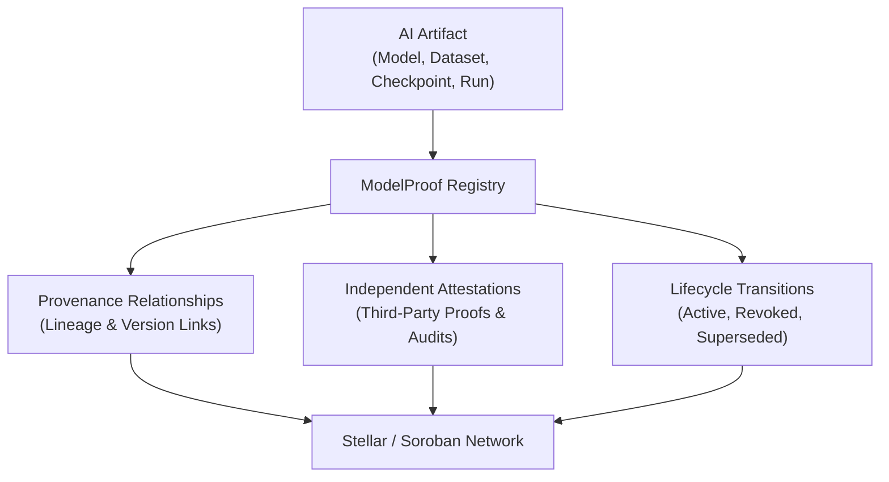

# ModelProof Contracts

[](https://github.com/ModelProof/modelproof-contracts/actions/workflows/ci.yml)
[](LICENSE)
[](https://soroban.stellar.org/)

`modelproof-contracts` is the open-source suite of Rust smart contracts powering **ModelProof** on the [Soroban](https://soroban.stellar.org/) smart contract platform and the [Stellar](https://stellar.org/) network.

---

## Table of Contents

- [About ModelProof](#about-modelproof)
- [Why AI Provenance Matters](#why-ai-provenance-matters)
- [Repository Contents](#repository-contents)
- [Architecture Overview](#architecture-overview)
  - [Architecture Flow](#architecture-flow)
- [Current Features](#current-features)
- [Contract Functions](#contract-functions)
  - [Artifact Management](#artifact-management)
  - [Provenance Relationships](#provenance-relationships)
  - [Independent Attestations](#independent-attestations)
- [Artifact Lifecycle](#artifact-lifecycle)
- [Supported Provenance Relationship Types](#supported-provenance-relationship-types)
- [Supported Attestation Types](#supported-attestation-types)
- [Error Handling & Error Codes](#error-handling--error-codes)
- [Project Status](#project-status)
- [Development Requirements](#development-requirements)
- [Setup Instructions](#setup-instructions)
- [Build Instructions](#build-instructions)
- [Test Instructions](#test-instructions)
- [Contributing](#contributing)
- [Security](#security)
- [License](#license)

---

## About ModelProof

**ModelProof** is an open, decentralized verification and provenance tracking registry for the artificial intelligence ecosystem. By anchoring cryptographic proofs, lineage graphs, evaluation checkpoints, and multi-party attestations directly onto the Stellar blockchain, ModelProof creates a transparent, tamper-resistant record of how AI systems are built, trained, audited, and superseded.

---

## Why AI Provenance Matters

As artificial intelligence models are deployed in mission-critical applications—from financial forecasting and automated governance to healthcare diagnostics and autonomous infrastructure—verifying model integrity and supply chain transparency is essential:

1. **Supply Chain Authenticity**: Prove that a production model originates from the exact dataset, base model checkpoint, and training run claimed by the developers.
2. **Safety, Red-Teaming & Compliance Auditing**: Allow independent third-party auditors and research institutions to attach verifiable inspection reports, reproduction proofs, and endorsements without modifying model ownership.
3. **Traceable Model Evolution**: Track iterative fine-tunes, dataset revisions, and version replacements through continuous, immutable version chains.
4. **Transparent Revocation**: Instantly alert downstream consumers when a compromised, copyrighted, poisoned, or flawed model is revoked or superseded, while immutably preserving the historical provenance record for forensic analysis.

---

## Repository Contents

```
modelproof-contracts/
├── .github/
│   ├── ISSUE_TEMPLATE/
│   │   ├── bug_report.md            # Standardized bug reporting template
│   │   └── feature_request.md       # Feature proposal template
│   ├── workflows/
│   │   └── ci.yml                   # Automated GitHub Actions CI workflow
│   └── pull_request_template.md     # PR submission checklist and guidelines
├── contracts/
│   └── registry/                    # Core ModelProof Registry contract
│       ├── Cargo.toml               # Package manifest for registry contract
│       └── src/
│           └── lib.rs               # Contract implementation and test suite
├── Cargo.toml                       # Workspace manifest & profile configuration
├── CODE_OF_CONDUCT.md               # Community contributor code of conduct
├── CONTRIBUTING.md                  # Development setup & contribution workflow
├── LICENSE                          # Apache-2.0 open-source license
├── README.md                        # Project documentation
├── rustfmt.toml                     # Workspace Rust formatting configuration
└── SECURITY.md                      # Security policy & private vulnerability reporting
```

---

## Architecture Overview

The core contract (`ModelProofRegistry`) provides a single, unified provenance registry operating within the Soroban execution environment. Persistent storage tracks artifact identities, bidirectional provenance relationships, independent third-party attestations, and lifecycle states.

### Architecture Flow



```text
AI Artifact
    ↓
ModelProof Registry
    ├── Provenance
    ├── Attestations
    └── Lifecycle
         ↓
Stellar / Soroban
```

---

## Current Features

- **Artifact Registration**: Decentralized, cryptographically-hashed AI asset registration with duplicate ID prevention and owner authentication.
- **Bidirectional Provenance Links**: Directed, typed lineage tracking connecting models, fine-tunes, datasets, and evaluation artifacts.
- **Independent Attestations**: Permissionless third-party auditing, verification, and evaluation stamping by any authorized Stellar address without altering asset ownership.
- **Lifecycle Status Management**: Formal tracking across `Active`, `Revoked`, and `Superseded` states with historical preservation.
- **Hardened Invariants & Security Validation**: Strict string validation, authorization checks, terminal transition protections, and atomic state updates that eliminate partial storage corruption on failures.

---

## Contract Functions

### Artifact Management

#### `register_artifact`
```rust
pub fn register_artifact(
    env: Env,
    owner: Address,
    artifact_id: String,
    artifact_hash: String,
    artifact_type: String,
) -> Result<ArtifactRecord, RegistryError>
```
- Registers a new AI artifact into persistent storage.
- Requires `owner.require_auth()`.
- Defaults status to `ArtifactStatus::Active`.
- Enforces non-empty `artifact_id`, `artifact_hash`, and `artifact_type`.
- Emits `("artifact_registered", artifact_id)` event with `owner`.

#### `get_artifact`
```rust
pub fn get_artifact(env: Env, artifact_id: String) -> Option<ArtifactRecord>
```
- Fetches the persistent `ArtifactRecord` for a given ID.
- Returns `None` if the artifact is not registered.

#### `revoke_artifact`
```rust
pub fn revoke_artifact(
    env: Env,
    artifact_id: String,
    revocation_reason_hash: String,
) -> Result<ArtifactRecord, RegistryError>
```
- Marks an artifact as `Revoked`.
- Requires authentication from the artifact owner.
- Enforces non-empty `revocation_reason_hash`.
- Rejects already-revoked or already-superseded artifacts.
- Preserves all existing provenance relations and attestations.
- Emits `("artifact_revoked", artifact_id)` event.

#### `supersede_artifact`
```rust
pub fn supersede_artifact(
    env: Env,
    old_artifact_id: String,
    replacement_artifact_id: String,
    provenance_relation_id: String,
) -> Result<ArtifactRecord, RegistryError>
```
- Transitions an existing artifact to `Superseded`.
- Requires authentication from the owner of the superseded artifact.
- Enforces non-empty `provenance_relation_id` and unique relation ID.
- Rejects self-superseding.
- Validates replacement artifact exists and is currently in `Active` status.
- Automatically establishes an internal `PreviousVersion` provenance link from replacement to old artifact.
- Emits `("artifact_superseded", old_artifact_id, replacement_artifact_id)` event.

---

### Provenance Relationships

#### `add_provenance_relation`
```rust
pub fn add_provenance_relation(
    env: Env,
    relation_id: String,
    source_artifact_id: String,
    target_artifact_id: String,
    relation_type: RelationType,
) -> Result<ProvenanceRelation, RegistryError>
```
- Connects a source artifact to a target artifact via a typed relationship.
- Requires `source_artifact.owner.require_auth()`.
- Validates non-empty `relation_id` and uniqueness.
- Rejects self-referencing links (`source == target`).
- Verifies both source and target artifacts exist and neither is `Revoked`.
- Dual-indexes the relation under both source and target artifact records.
- Emits `("provenance_relation_added", source_artifact_id, target_artifact_id)` event.

#### `get_provenance_relation`
```rust
pub fn get_provenance_relation(env: Env, relation_id: String) -> Option<ProvenanceRelation>
```
- Retrieves a specific relation record by its unique ID.

#### `get_artifact_relations`
```rust
pub fn get_artifact_relations(env: Env, artifact_id: String) -> Vec<ProvenanceRelation>
```
- Returns all provenance relationship records where `artifact_id` participates as source or target.

---

### Independent Attestations

#### `add_attestation`
```rust
pub fn add_attestation(
    env: Env,
    attestation_id: String,
    artifact_id: String,
    attester: Address,
    attestation_type: AttestationType,
    evidence_hash: String,
) -> Result<Attestation, RegistryError>
```
- Records a third-party evaluation, audit, verification, reproduction, or endorsement.
- Requires `attester.require_auth()`.
- Validates non-empty `attestation_id` and `evidence_hash`.
- Enforces uniqueness of `attestation_id`.
- Requires target artifact to exist and not be in `Revoked` status.
- Indexes attestation under the target artifact.
- Emits `("attestation_added", attestation_id, artifact_id)` event.

#### `get_attestation`
```rust
pub fn get_attestation(env: Env, attestation_id: String) -> Option<Attestation>
```
- Retrieves a specific attestation record by its unique ID.

#### `get_artifact_attestations`
```rust
pub fn get_artifact_attestations(env: Env, artifact_id: String) -> Vec<Attestation>
```
- Returns all attestations attached to the specified artifact.

---

## Artifact Lifecycle

```text
            register_artifact
                  │
                  ▼
            ┌───────────┐
            │  Active   │
            └─────┬─────┘
                  │
        ┌─────────┴─────────┐
        │                   │
   revoke_artifact    supersede_artifact
        │                   │
        ▼                   ▼
    ┌─────────┐       ┌────────────┐
    │ Revoked │       │ Superseded │
    └─────────┘       └────────────┘
```

- **Active**: Newly registered artifact, fully eligible for attestations and provenance links.
- **Revoked**: Terminal state indicating the asset was compromised, poisoned, or retracted. Ineligible for new relations, attestations, or superseding. Existing history is permanently preserved.
- **Superseded**: Terminal state indicating the asset was replaced by a newer version. Ineligible for revocation or subsequent re-superseding. Historic provenance links and attestations remain queryable.

---

## Supported Provenance Relationship Types

| Variant | Meaning | Typical Usage |
|---|---|---|
| `DerivedFrom` | Derived from parent asset | Fine-tuned weights derived from base foundation model |
| `TrainedOn` | Trained using a specific dataset | Training checkpoint linked to raw/curated dataset artifact |
| `EvaluatedWith` | Evaluated against a benchmark | Evaluation run linked to benchmark dataset |
| `PreviousVersion` | Direct ancestral version link | Auto-created on superseding or manual version chains |
| `ProducedBy` | Produced by an execution run | Exported weights linked to reproducible training pipeline run |

---

## Supported Attestation Types

| Variant | Meaning | Typical Usage |
|---|---|---|
| `Verified` | Identity or hash integrity confirmed | Publisher identity or cryptographic checksum verification |
| `Audited` | Formally inspected by auditors | Safety, security, alignment, or bias audit certification |
| `Evaluated` | Performance benchmarked | Accuracy, latency, or throughput evaluation report |
| `Reproduced` | Training/evaluation reproduced | Independent researcher reproducing reported results |
| `Endorsed` | Recommended by authoritative body | Enterprise deployment or open-source foundation endorsement |

---

## Error Handling & Error Codes

The contract uses `RegistryError`, an explicit `#[contracterror]` enum where every invariant failure returns a dedicated error code:

| Code | Error Variant | Description |
|---|---|---|
| `1` | `AlreadyExists` | An artifact with this `artifact_id` is already registered. |
| `2` | `NotFound` | Record could not be found. |
| `3` | `SourceArtifactNotFound` | Source artifact does not exist when creating a provenance relation. |
| `4` | `TargetArtifactNotFound` | Target artifact does not exist when creating a provenance relation. |
| `5` | `SelfReferencingNotAllowed` | Attempted self-referencing relation or self-superseding (`source == target`). |
| `6` | `RelationAlreadyExists` | A relation with this `relation_id` already exists. |
| `7` | `ArtifactNotFound` | Target artifact does not exist for attestation, lookup, or revocation. |
| `8` | `AttestationAlreadyExists` | An attestation with this `attestation_id` already exists. |
| `9` | `EmptyEvidenceHash` | Attestation rejected: `evidence_hash` string is empty. |
| `10` | `ArtifactAlreadyRevoked` | Revocation rejected: artifact is already in `Revoked` status. |
| `11` | `EmptyRevocationReason` | Revocation rejected: `revocation_reason_hash` string is empty. |
| `12` | `ReplacementArtifactNotFound` | Superseding rejected: replacement artifact ID does not exist. |
| `13` | `EmptyArtifactId` | Registration rejected: `artifact_id` string is empty. |
| `14` | `EmptyArtifactHash` | Registration rejected: `artifact_hash` string is empty. |
| `15` | `EmptyArtifactType` | Registration rejected: `artifact_type` string is empty. |
| `16` | `EmptyRelationId` | Relation or superseding rejected: `relation_id` string is empty. |
| `17` | `SourceArtifactRevoked` | Provenance relation rejected: source artifact has been revoked. |
| `18` | `TargetArtifactRevoked` | Provenance relation rejected: target artifact has been revoked. |
| `19` | `EmptyAttestationId` | Attestation rejected: `attestation_id` string is empty. |
| `20` | `CannotAttestRevokedArtifact` | Attestation rejected: cannot attach attestations to a revoked artifact. |
| `21` | `CannotRevokeSupersededArtifact` | Revocation rejected: a superseded artifact cannot be revoked. |
| `22` | `CannotSupersedeRevokedArtifact` | Superseding rejected: a revoked artifact cannot be superseded. |
| `23` | `ArtifactAlreadySuperseded` | Superseding rejected: artifact has already been superseded. |
| `24` | `ReplacementArtifactNotActive` | Superseding rejected: replacement artifact must be in `Active` status. |

---

## Project Status

ModelProof Contracts is currently at **v0.1.0** (development release).
The core registry contract interface is functional, fully unit-tested (41 passing tests), hardened against invalid inputs and partial mutations, and ready for contributor review and integration testing on Stellar testnet.

---

## Development Requirements

- **Rust**: Stable toolchain (Rust 1.80+)
- **WASM Target**: `wasm32-unknown-unknown`
- **Soroban SDK**: `22.0.1` (resolves to `22.0.11`)
- **Git**: For version control

---

## Setup Instructions

1. **Clone the repository**:
   ```bash
   git clone https://github.com/ModelProof/modelproof-contracts.git
   cd modelproof-contracts
   ```

2. **Add the WASM compilation target**:
   ```bash
   rustup target add wasm32-unknown-unknown
   ```

3. **Install Soroban CLI** (optional, for contract deployments):
   ```bash
   cargo install --locked soroban-cli
   ```

---

## Build Instructions

### Compile Workspace (Host)
```bash
cargo build
```

### Compile Optimized WASM Bytecode (Release)
```bash
cargo build --target wasm32-unknown-unknown --release
```

The optimized contract binary will be output to:
```
target/wasm32-unknown-unknown/release/modelproof_registry.wasm
```

---

## Test Instructions

Execute the complete unit test suite:
```bash
cargo test --lib
```

> **Note**: Include `--lib` when running tests locally on Windows GNU toolchains to avoid multi-crate cdylib test binary linking limitations.

Verify code formatting:
```bash
cargo fmt --all -- --check
```

Run linter checks:
```bash
cargo clippy --all-targets -- -D warnings
```

---

## Contributing

We welcome contributions from the community! Please read our [Contributing Guidelines](CONTRIBUTING.md) and adhere to our [Code of Conduct](CODE_OF_CONDUCT.md).

To report bugs or propose new features, please use our GitHub issue templates:
- [Bug Report](.github/ISSUE_TEMPLATE/bug_report.md)
- [Feature Request](.github/ISSUE_TEMPLATE/feature_request.md)

---

## Security

We take smart contract security and data integrity seriously. If you identify a security vulnerability, please report it responsibly using **GitHub Private Vulnerability Reporting** as detailed in [SECURITY.md](SECURITY.md). Please do not open public issues for security vulnerabilities.

---

## License

This project is licensed under the **Apache License, Version 2.0**.
See [LICENSE](LICENSE) for the full license text.
